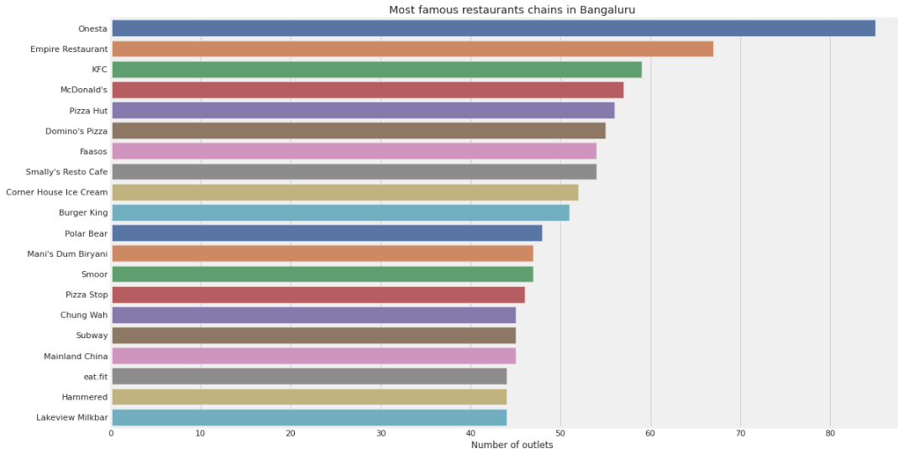
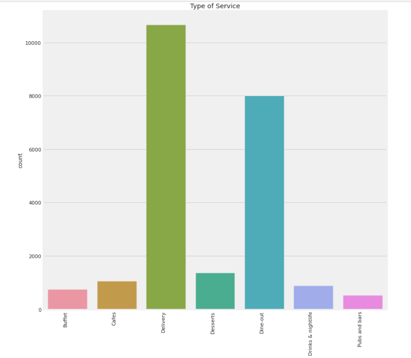

## Zomato Restaurant Rating

## Table of Content
  * [Problem Statement](#problem-statement)
  * [Approach](#approach)
  * [Technologies Used](#technologies-used)
  * [Installation](#installation)
  * [Bugs & Logs](#bugs--logs)
  * [Contributors](#contributors)

## Demo



## Problem Statement
I was always fascinated by the food culture of Bengaluru. Restaurants from all over the world can be found here in Bengaluru. From United States to Japan, Russia to Antarctica, you get all type of cuisines here. Delivery, Dine-out, Pubs, Bars, Drinks,Buffet, Desserts you name it and Bengaluru has it. Bengaluru is best place for foodies. The number of restaurant are increasing day by day. Currently which stands at approximately 12,000 restaurants. With such an high number of restaurants. This industry hasn't been saturated yet. And new restaurants are opening every day. However it has become difficult for them to compete with already established restaurants. The key issues that continue to pose a challenge to them include high real estate costs, rising food costs, shortage of quality manpower, fragmented supply chain and over-licensing. This Zomato data aims at analysing demography of the location. Most importantly it will help new restaurants in deciding their theme, menus, cuisine, cost etc for a particular location. It also aims at finding similarity between neighborhoods of Bengaluru on the basis of food. The dataset also contains reviews for each of the restaurant which will help in finding overall rating for the place.

## Approach
Data Exploration : I started exploring dataset using pandas,numpy,matplotlib and seaborn.

Data visualization : Ploted graphs to get insights about dependend and independed variables.

Feature Engineering : Removed missing values and created new features as per insights.

Model Building & Testing : Tried many machine learning algorithms and checked the base accuracy to find the best fit.
                          
## Technologies Used
 
   1. Python 
   2. Sklearn
   3. XGBoost
   4. Pandas, Numpy 
  
## Dataset
[Download here](https://www.kaggle.com/himanshupoddar/zomato-bangalore-restaurants/download)


## Installation
Click here to install [python](https://www.python.org/downloads/). To install the required packages and libraries, run this pip command in the project directory after cloning the repository:
```bash
git clone https://github.com/hrishikeshkini/Zomato-Restaurant-Rating.git
```
If pip is not already installed, Follow this [link](https://pip.pypa.io/en/stable/installation/)

## Bugs & Logs

1. If you find a bug, kindly open an issue and it will be addressed as early as possible. [Open](https://github.com/hrishikeshkini/Zomato-Restaurant-Rating/issues)
2. Under localhost, logging is performed for all the actions and its stored onto logs.txt file

## Contributors
  [Hrishikesh Kini](https://github.com/hrishikeshkini)

